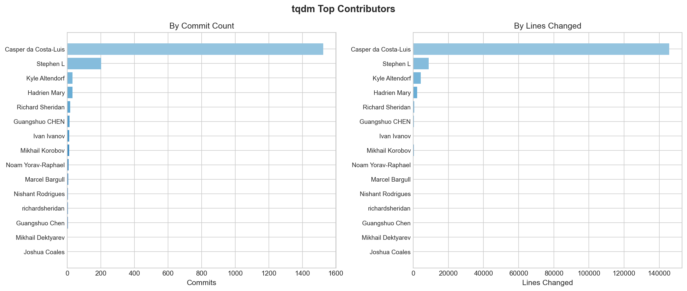
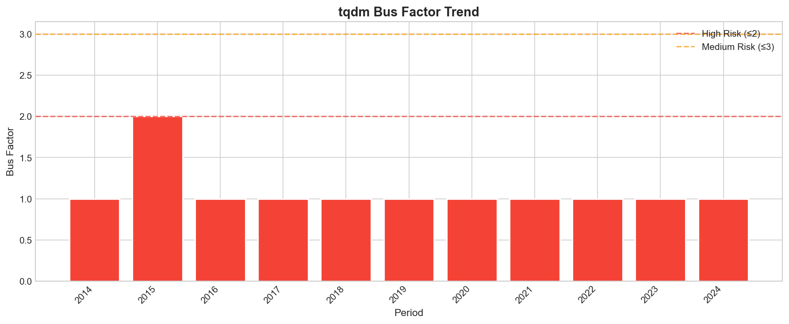
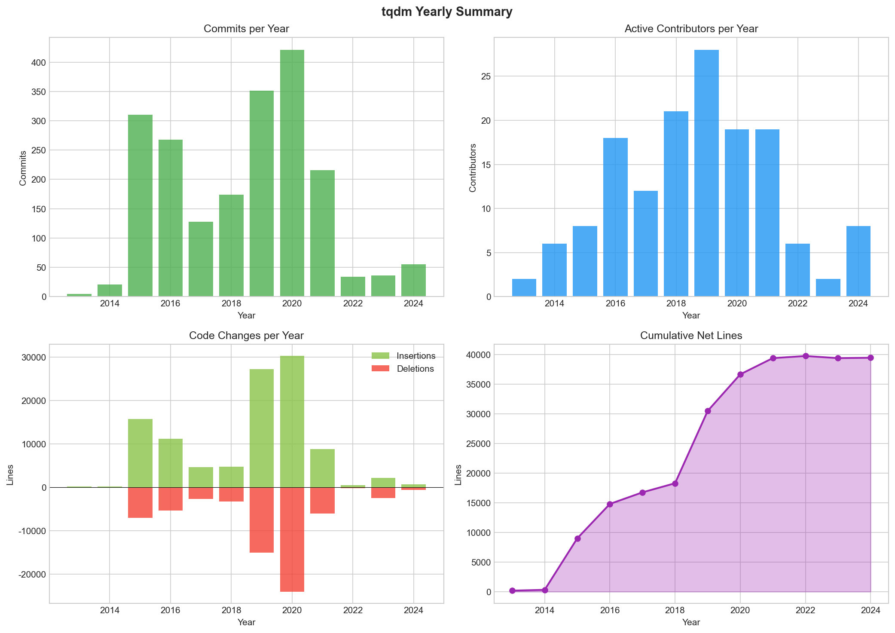
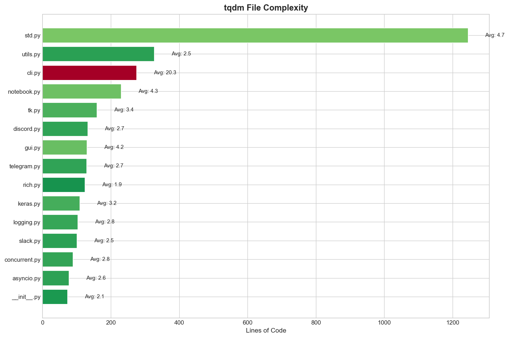
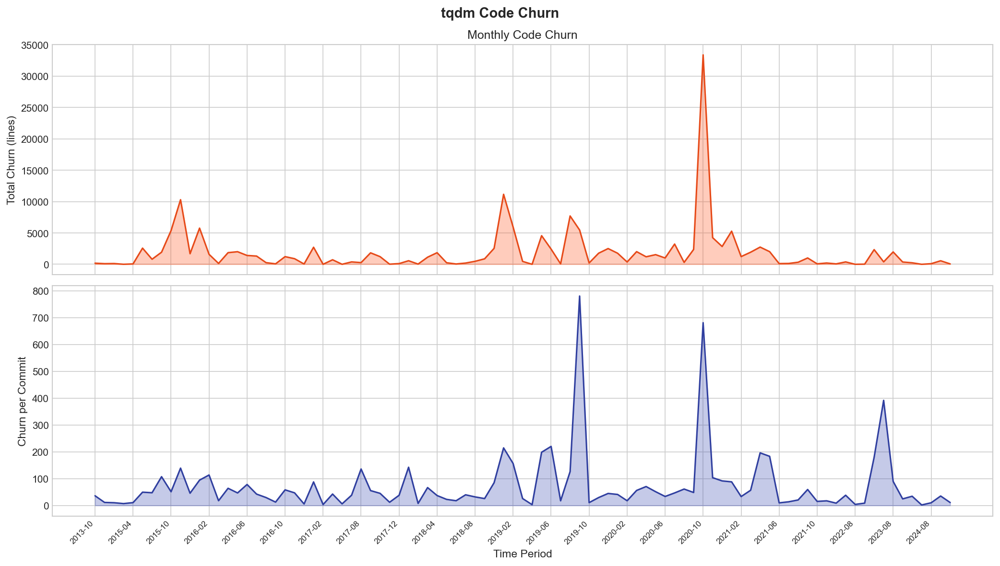
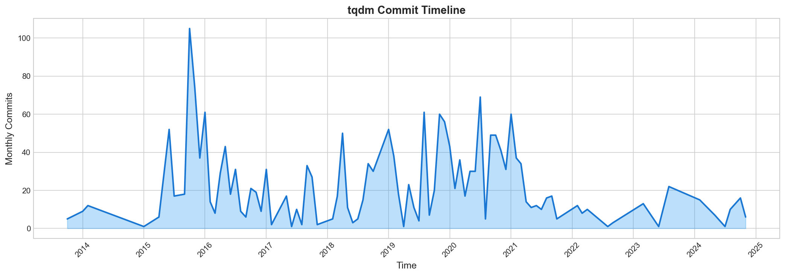
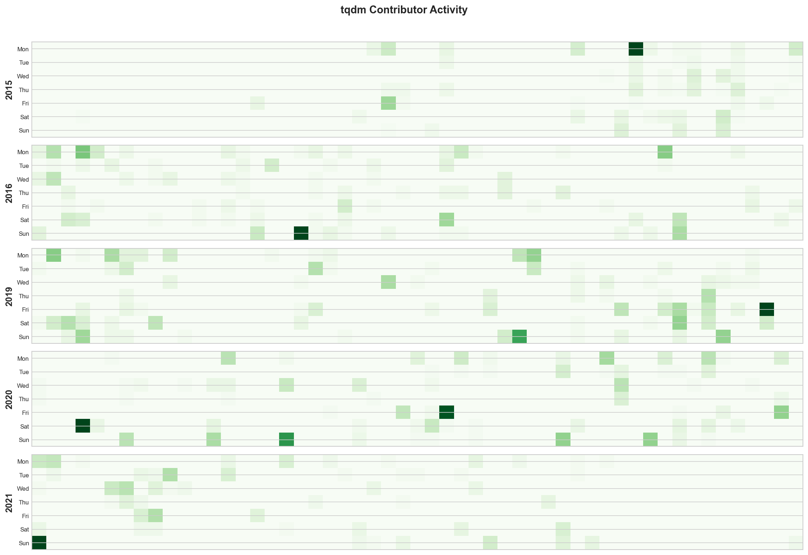
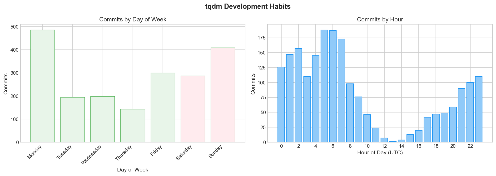

# 绪论

## 研究背景

在现代软件开发中，命令行界面（CLI）应用程序仍然占据着重要地位。无论是数据处理脚本，还是机器学习训练流程，开发者都需要一种直观的方式来了解程序当前的执行进度。进度条作为最常见的反馈机制之一，不仅能够给用户提供即时的视觉反馈，还能帮助开发者了解长时间运行的任务。

**tqdm**（源自阿拉伯语 *taqaddum*，意为“进步”）是Python生态系统中最受欢迎的进度条库之一。自2013年首次发布以来，tqdm以其极低的性能开销、无需任何依赖和优秀的跨平台兼容性，赢得了开发者社区的广泛认可。截至目前，tqdm在GitHub上已收获近3万颗star，依据Github Insights里的统计数据，其已被100多万个仓库采用，其中不乏如NumPy、Pandas、TensorFlow等众多知名项目。

## tqdm与同类库的对比

在Python的进度条库生态中，tqdm并不是唯一的选择。但相比于其他进度条库，tqdm在性能、依赖性和跨平台兼容性等方面都有着显著优势。根据tqdm文档及网络汇总，可以得到以下对比：

| 特性 | tqdm | progressbar2 | alive-progress | rich.progress |
|------|------|--------------|----------------|---------------|
| 每次迭代开销 | ~60ns | ~800ns | ~100–300ns | ~400–600ns |
| 性能 | 极低 | 中等偏高 | 中等 | 中等 |
| 零依赖 | 是 | 是 | 否 | 否 |
| Jupyter支持 | 优秀 | 弱支持 | 良好 | 优秀 |
| CLI管道模式 | 支持 | 弱支持 | 不支持 | 不支持 |
| 嵌套进度条 | 支持 | 支持 | 优秀 | 支持 |
| Pandas集成 | 原生 | 无 | 无 | 无 |

tqdm的核心优势在于其“开箱即用”的便捷性——只需要用`tqdm()`包裹住任意的可迭代对象，即可立即获得功能完备的进度条，无需任何配置。例如：

```python
from tqdm import tqdm
for item in tqdm(range(10000)):
    process(item)
```

输出效果：

```
76%|████████████████████████        | 7568/10000 [00:33<00:10, 229.00it/s]
```

## 项目目标与意义

本课程作业以tqdm为分析对象，旨在实现以下目标：

1. **数据挖掘**：自动化提取tqdm仓库的Git提交历史，获取作者、时间、代码变更量等统计信息
2. **代码分析**：利用ast静态分析，评估代码结构复杂度和演化趋势
3. **可视化呈现**：将分析结果转化为直观的图表，揭示项目发展规律
4. **开源实践**：通过团队协作开发，理解Git版本控制和开源协作流程

# 需求分析

## 项目背景

随着开源软件生态的蓬勃发展，越来越多的项目依赖于社区贡献者的协作开发。因此，评估一个开源项目的健康度、维护质量和可持续性便成了一个重要的问题。传统的评估方法往往依赖主观判断或者单一指标（比如Star数等），而缺乏系统性的量化分析。

本工具以tqdm为案例，旨在通过自动挖掘开源仓库的提交信息，可以帮助回答以下问题：

- 项目的核心维护者是谁？贡献分布是否健康？
- 项目的开发活跃度如何随时间变化？
- 代码的复杂度是否在可控范围内？是否存在技术债务等等？
- 项目是否仅依赖少数头部贡献者？

## 功能需求

### 数据提取需求

这部分负责从Git仓库中提取提交历史，包括提交信息、作者、时间、代码变更量等数据，以便后续处理。

| 需求描述 | 优先级 |
|---------|---------|
| 能够解析本地Git仓库的完整提交历史 | 高 |
| 提取每次提交的详细信息 | 高 |
| 支持指定分支进行分析 | 低 |
| 导出结构化数据为CSV格式 | 中 |

### 代码分析需求

这部分负责对提取的代码进行静态分析，包括函数定义、类定义的数量、计算环形复杂度等指标。

| 需求描述 | 优先级 |
|---------|---------|
| 递归扫描整个源代码目录 | 高 |
| 使用AST解析Python源文件结构 | 高 |
| 统计函数定义、类定义的数量 | 高 |
| 计算环形复杂度 | 高 |
| 识别高复杂度函数并生成列表 | 中 |

### 数据可视化需求

这部分负责将提取的提交历史和代码分析结果进行可视化展示，包括提交时间线、贡献者分布、年度发展概览等图表。

| 需求描述 | 优先级 |
|---------|---------|
| 绘制提交时间线图 | 高 |
| 绘制贡献者分布图 | 高 |
| 绘制年度发展概览图 | 高 |
| 绘制代码搅动率趋势图 | 中 |
| 绘制贡献者活跃热力图 | 中 |
| 绘制公共汽车系数趋势图 | 中 |
| 绘制文件复杂度对比图 | 中 |

## 非功能需求

1. **可复用性**：工具应具备良好的模块化设计，稍加修改即可应用于其他Python开源项目的分析；
2. **高效性**：能够在合理时间内（分钟级别）高效率地处理包含数千次提交的大型仓库；
3. **可读性**：代码应包含清晰的注释和文档字符串，便于后续维护和扩展；

# 总体设计

## 系统架构设计

整体采用分层架构设计。

### 数据访问层

负责与底层数据源（Git仓库、Python源文件）进行交互。这部分主要依赖现成的库函数：

- **GitPython**：Python封装的Git库，提供对`.git`目录的访问
- **Python ast**：Python内置的抽象语法树模块，用于解析Python源代码

### 业务逻辑层

包含两个核心分析器类：

- **GitAnalyzer**：封装Git数据提取与统计分析逻辑
- **CodeAnalyzer**：封装静态代码分析与复杂度计算逻辑

### 表现层

负责数据清洗与可视化呈现：

- **Visualizer**：使用Matplotlib生成各类统计图表
- **Report Generator**：汇总分析结果生成Markdown报告

## 模块划分

项目源代码位于`src/`目录，包含以下核心文件：

```
src/
├── main.py           # 主程序入口
├── git_analyzer.py   # Git记录分析模块
├── code_analyzer.py  # 静态代码分析模块
├── visualizer.py     # 数据可视化模块
└── output/           # 分析结果输出目录
    ├── *.csv         # 结构化数据文件
    ├── *.png         # 可视化生成图表
    └── analysis_report.md  # 分析报告
```

### main.py - 主程序入口

作为整个分析流程的主入口，`main.py`负责：

- 解析命令行参数
- 按顺序调用Git分析和代码分析模块
- 触发可视化图表生成

例如，支持的命令行参数包括：

```bash
python main.py --repo ../tqdm --output ./output
python main.py --skip-git   # 跳过Git分析
python main.py --skip-code  # 跳过代码分析
```

### git_analyzer.py - Git分析模块

封装了对Git仓库的各种分析操作。`GitAnalyzer`类主要提供了以下方法：

| 方法名 | 功能描述 |
|-------|---------|
| `get_all_commits()` | 获取指定分支的所有提交记录 |
| `get_commit_stats_by_author()` | 按作者统计贡献量 |
| `get_commit_stats_by_time()` | 按时间频率分组统计 |
| `get_file_change_history()` | 获取指定文件的修改历史 |
| `calculate_code_churn()` | 计算代码搅动率 |
| `calculate_bus_factor()` | 计算公共汽车系数 |
| `get_commit_time_distribution()` | 分析提交时间分布 |
| `get_yearly_summary()` | 生成年度汇总统计 |

### code_analyzer.py - 代码分析模块

使用Python ast模块进行静态代码分析。`CodeAnalyzer`类主要提供了以下方法：

| 方法名 | 功能描述 |
|-------|---------|
| `analyze_file()` | 分析单个Python文件 |
| `analyze_directory()` | 递归扫描整个目录 |
| `get_complexity_report()` | 生成复杂度统计报告 |
| `find_complex_functions()` | 查找高复杂度函数 |

分析结果使用数据类进行存储，包含这三个数据类：

- `FunctionInfo`：函数信息（名称、行号、参数数量、复杂度等）
- `ClassInfo`：类信息（名称、方法列表、基类等）
- `FileAnalysis`：文件分析结果（导入列表、函数/类定义、复杂度指标等）

### visualizer.py - 可视化模块

负责将分析结果转化为直观的图表。`Visualizer`类主要提供了以下方法：

| 方法名 | 生成图表类型 |
|-------|------------|
| `plot_commit_timeline()` | 提交时间线图 |
| `plot_contributor_heatmap()` | 贡献者活跃热力图 |
| `plot_author_distribution()` | 贡献者分布对比图 |
| `plot_weekly_pattern()` | 开发习惯分析图 |
| `plot_yearly_summary()` | 年度发展概览图 |
| `plot_code_churn()` | 代码搅动率趋势图 |
| `plot_bus_factor_trend()` | 公共汽车系数趋势图 |
| `plot_file_complexity_comparison()` | 文件复杂度对比图 |

# 详细设计与实现

## Git数据提取模块

### 实现机制

Git分析模块的核心是利用GitPython库封装对`.git`文件夹的操作。GitPython提供了对Git对象模型的完整访问能力，其中包括Commit、Tree、Blob等核心对象。

```python
class GitAnalyzer:
    """
    封装了对Git仓库的各种分析操作，并将Commit记录转为Pandas库的DataFrame方便后续处理。
    """

    def __init__(self, repo_path: str):
        self.repo_path = repo_path
        self.repo = Repo(repo_path)
```

### 提交记录提取

`get_all_commits()`方法遍历指定分支的所有Commit对象，并提取关键的数据信息：

```python
def get_all_commits(self, branch: str = None) -> pd.DataFrame:
    if branch is None:
        branch = (
            self.repo.active_branch.name
        )  # 防止分支名如master和main不同导致的问题
    commits_data = []
    for commit in self.repo.iter_commits(branch):
        stats = commit.stats.total  # 包含该次提交的统计信息
        commits_data.append(
            {
                "hash": commit.hexsha,
                "short_hash": commit.hexsha[:7],
                "author_name": commit.author.name,
                # 在cherry-pick、rebase、merge PR时，committer和author可能不同
                "committer_name": commit.committer.name,
                # 默认是时间戳样式，需要转换为datetime
                "date": datetime.fromtimestamp(commit.committed_date),
                "message": commit.message.strip(),
                "headline": commit.message.strip().split("\n")[0],
                "insertions": stats.get("insertions", 0),  # 新增行数
                "deletions": stats.get("deletions", 0),  # 删除行数
                "files_changed": stats.get("files", 0),  # 变更文件数
            }
        )
    df = pd.DataFrame(commits_data)
    df["lines_changed"] = df["insertions"] + df["deletions"]  # 总变更行数
    return df.sort_values("date").reset_index(drop=True)
```

返回的DataFrame结构包括哈希、短哈希、作者名、提交者名、提交时间等基本信息。

### 贡献者统计

`get_commit_stats_by_author()`方法按作者聚合统计各项贡献指标：

```python
def get_commit_stats_by_author(
    self, commits_df: pd.DataFrame = None
) -> pd.DataFrame:
    """
    按作者名统计其贡献量。并计算每个作者的：
    - 提交次数
    - 新增/删除的代码行数
    - 修改的文件数
    - 首次/最后一次提交时间

    Args:
        commits_df (pd.DataFrame, optional): 提交记录。不传入则自动使用全部提交

    Returns:
        pd.DataFrame: 按作者统计的贡献表，按提交数降序排列
    """
    if commits_df is None:
        commits_df = self.get_all_commits()
    stats = (
        commits_df.groupby("author_name")
        .agg(
            {
                "hash": "count",
                "insertions": "sum",
                "deletions": "sum",
                "files_changed": "sum",
                "date": ["min", "max"],
            }
        )
        .reset_index()
    )
    # 重命名展平后的列名
    stats.columns = [
        "author",
        "commits",
        "insertions",
        "deletions",
        "files_changed",
        "first_commit",
        "last_commit",
    ]
    stats["total_lines"] = stats["insertions"] + stats["deletions"]
    # 按提交数降序排列即贡献最多的最靠前
    return stats.sort_values("commits", ascending=False).reset_index(drop=True)
```

同理，还有其他的如将提交按指定的时间频率分组、统计每个时间段内的提交情况的方法（`get_commit_stats_by_time`）；分析开发者的提交时间分布的方法（`get_commit_time_distribution`）；以及获取指定文件在整个仓库历史中的所有修改记录的方法（`get_file_change_history`）和生成年度统计报告的方法（`get_yearly_summary`）。大体思路是一致的，在此不赘述。

### 代码搅动率计算

代码搅动率（Code Churn）是衡量代码变更剧烈程度的重要指标，定义为特定时间窗口内的代码变更总量，其值等于新增的行数与删除的行数之和：

```python
def calculate_code_churn(
    self, commits_df: pd.DataFrame = None, window: str = "M"
) -> pd.DataFrame:
    if commits_df is None:
        commits_df = self.get_all_commits()
    df = commits_df.copy()
    df["period"] = df["date"].dt.to_period(window)
    churn = (
        df.groupby("period")
        .agg(
            {
                "insertions": "sum",
                "deletions": "sum",
                "hash": "count",
            }
        )
        .reset_index()
    )
    churn.columns = ["period", "insertions", "deletions", "commits"]
    churn["churn"] = churn["insertions"] + churn["deletions"]  #
    churn["churn_per_commit"] = churn["churn"] / churn["commits"]
    churn["period"] = churn["period"].astype(str)  # 转字符串
    return churn
```

### 公共汽车系数计算

公共汽车系数（Bus Factor）是衡量开源项目风险的关键指标。公共汽车系数的定义为：一个项目或项目至少失去若干关键成员的参与（典型即“被巴士撞了”）而导致项目陷入混乱、瘫痪而无法存续时，这些成员的数量。也被翻译为巴士系数。也即该数值表示至少需要多少核心开发者离开才会导致项目难以为继。

```python
def calculate_bus_factor(
    self, commits_df: pd.DataFrame = None, threshold: float = 0.5
) -> Dict:
    """
    计算公共汽车系数 (Bus Factor)。

    计算方法：
    1. 按提交数对贡献者降序排序
    2. 计算累计贡献比例
    3. 找到累计贡献超过阈值（默认50%）所需的最少人数

    Args:
        commits_df (pd.DataFrame, optional): 提交记录
        threshold (float): 贡献占比阈值，默认为0.5即50%。

    Returns:
        Dict: 包含以下字段：
            - bus_factor: 公共汽车系数
            - threshold: 使用的阈值
            - total_authors: 总贡献者数
            - total_commits: 总提交数
            - top_contributors: 核心贡献者列表（包含姓名、提交数、占比）
    """
    if commits_df is None:
        commits_df = self.get_all_commits()
    author_stats = self.get_commit_stats_by_author(commits_df)
    total_commits = author_stats["commits"].sum()

    # 每个作者的提交占比
    author_stats["commit_ratio"] = author_stats["commits"] / total_commits

    # 计算累计占比（从贡献最多的开始累加）
    author_stats["cumulative_ratio"] = author_stats["commit_ratio"].cumsum()

    bus_factor = (author_stats["cumulative_ratio"] <= threshold).sum() + 1
    bus_factor = min(bus_factor, len(author_stats))  # 防止阈值设置成100%时溢出

    top_contributors = author_stats.head(bus_factor)[
        ["author", "commits", "commit_ratio"]
    ].to_dict("records")

    return {
        "bus_factor": bus_factor,
        "threshold": threshold,
        "total_authors": len(author_stats),
        "total_commits": total_commits,
        "top_contributors": top_contributors,
    }
```

## 静态代码分析模块

### 实现机制

代码分析模块使用Python内置的`ast`抽象语法树模块进行静态解析。AST将源代码抽象为树形结构，而每个节点则代表一种语法结构（如函数定义、类定义、表达式等）。

```python
class CodeAnalyzer:
    """
    Python源代码静态分析器，使用ast解析提取代码结构信息与复杂度指标。
    """

    def analyze_file(self, filepath: str) -> FileAnalysis:
        """
        分析单个Python文件，提取其结构信息与代码指标。

        Args:
            filepath (str): Python文件的路径

        Returns:
            FileAnalysis: 包含文件结构和指标的分析结果
        """
        with open(filepath, "r", encoding="utf-8") as f:
            source = f.read()

        lines_of_code = len(
            [
                l
                for l in source.split("\n")
                if l.strip() and not l.strip().startswith("#")
            ]
        )
        tree = ast.parse(source)  # 构建ast语法树

        result = FileAnalysis(filepath=filepath, lines_of_code=lines_of_code)

        # 获取依赖关系
        for node in ast.walk(tree):
            if isinstance(node, ast.Import):
                for alias in node.names:
                    result.imports.append(alias.name)
            elif isinstance(node, ast.ImportFrom):
                module = node.module or ""
                for alias in node.names:
                    result.from_imports.append(
                        {"module": module, "name": alias.name, "alias": alias.asname}
                    )

        # 查找函数、类和全局变量
        for node in ast.iter_child_nodes(tree):
            if isinstance(node, (ast.FunctionDef, ast.AsyncFunctionDef)):
                result.functions.append(self._analyze_function(node))
            elif isinstance(node, ast.ClassDef):
                result.classes.append(self._analyze_class(node))
            elif isinstance(node, ast.Assign):
                for target in node.targets:
                    if isinstance(target, ast.Name):
                        result.global_variables.append(target.id)

        if RADON_AVAILABLE:
            cc_results = cc_visit(source)
            if cc_results:
                result.complexity_score = sum(b.complexity for b in cc_results) / len(
                    cc_results
                )
            result.maintainability_index = mi_visit(source, True)

        return result
```

### 函数与类定义提取

通过遍历AST节点，识别并提取函数定义（`FunctionDef`/`AsyncFunctionDef`）和类定义（`ClassDef`），方便后续计算环形复杂度。

```python
    def _analyze_function(self, node) -> FunctionInfo:
        """分析函数节点，获取函数信息。"""
        decorators = []
        for dec in node.decorator_list:
            if isinstance(dec, ast.Name):
                decorators.append(dec.id)
            elif isinstance(dec, ast.Call) and isinstance(dec.func, ast.Name):
                decorators.append(dec.func.id)
            elif isinstance(dec, ast.Attribute):
                decorators.append(dec.attr)
        docstring = ast.get_docstring(node)
        return FunctionInfo(
            name=node.name,
            lineno=node.lineno,
            end_lineno=getattr(node, "end_lineno", node.lineno),
            args_count=len(node.args.args),
            decorators=decorators,
            docstring=docstring,
            complexity=self._calculate_complexity(node),
        )

    def _analyze_class(self, node) -> ClassInfo:
        """分析类节点，获取类的信息及其方法。"""
        methods = []
        for item in node.body:
            if isinstance(item, (ast.FunctionDef, ast.AsyncFunctionDef)):
                methods.append(self._analyze_function(item))

        bases = []
        for base in node.bases:
            if isinstance(base, ast.Name):
                bases.append(base.id)
            elif isinstance(base, ast.Attribute):
                bases.append(base.attr)

        decorators = [
            dec.id for dec in node.decorator_list if isinstance(dec, ast.Name)
        ]
        docstring = ast.get_docstring(node)

        return ClassInfo(
            name=node.name,
            lineno=node.lineno,
            end_lineno=getattr(node, "end_lineno", node.lineno),
            methods=methods,
            bases=bases,
            decorators=decorators,
            docstring=docstring[:100] + "..."
            if docstring and len(docstring) > 100
            else docstring,
        )
```

### 环形复杂度计算

环形复杂度（Cyclomatic Complexity）的核心思想是：程序的复杂度与控制流图中的独立路径数成正比。最简单的计算方法即是1加上代码中的分支节点数。当一个函数的环形复杂度较大时，通常就意味着这个函数承担了太多的责任，需要把它拆分成多个小函数。

```python
def _calculate_complexity(self, node) -> int:
    complexity = 1  # 基础复杂度为1
    for child in ast.walk(node):
        if isinstance(child, (ast.If, ast.While, ast.For, ast.AsyncFor)):
            complexity += 1  # 分支+1
        elif isinstance(child, ast.ExceptHandler):
            complexity += 1  # 异常+1
        elif isinstance(child, ast.BoolOp):
            complexity += len(child.values) - 1  # 等效多个表达式
        elif isinstance(
            child, (ast.ListComp, ast.SetComp, ast.DictComp, ast.GeneratorExp)
        ):
            complexity += 1  # 各种推导式等+1
    return complexity
```

### 目录递归扫描

`analyze_directory()`方法递归扫描整个源代码目录，并自动跳过`__pycache__`缓存目录：

```python
def analyze_directory(self, dir_path: str) -> List[FileAnalysis]:
    """
    递归扫描整个文件夹并跳过 __pycache__ 目录.
    """
    results = []
    for py_file in Path(dir_path).rglob("*.py"):
        if "__pycache__" not in str(py_file):
            results.append(self.analyze_file(str(py_file)))
    return results
```

### 其他函数

其他函数就是对上述函数的封装与进一步分析。例如，`find_complex_functions`可以查找环形复杂度超过传入阈值（默认是10）的函数。`count_definitions`可以统计文件中各类代码定义的数量，即一个文件里有多少个类、函数、变量等等。

## 数据可视化模块

### 技术选型与配置

可视化模块基于Matplotlib构建。

```python
import matplotlib.pyplot as plt

plt.rcParams["font.sans-serif"] = ["SimHei", "DejaVu Sans", "Arial Unicode MS"]
plt.rcParams["axes.unicode_minus"] = False  # 解决负号显示问题
plt.style.use("seaborn-v0_8-whitegrid")
```

### Visualizer类设计

```python
class Visualizer:
    """
    数据可视化类，负责将分析结果生成为各类统计图表并保存到本地。衔接前两个analyzer的api。
    """

    def __init__(self, output_dir: str = "./output", dpi: int = 150):
        self.output_dir = output_dir
        self.dpi = dpi
        os.makedirs(output_dir, exist_ok=True)

    def _save_fig(self, fig, name: str) -> str:
        """保存图表到文件并返回文件路径"""
        filepath = os.path.join(self.output_dir, f"{name}.png")
        fig.savefig(filepath, dpi=self.dpi, bbox_inches="tight", facecolor="white")
        print(f"图表已保存: {filepath}")
        plt.close(fig)
        return filepath
```

### 提交时间线图

展示项目按月统计的提交数量变化趋势。

```python
def plot_commit_timeline(
    self,
    commits_df: pd.DataFrame,
    title: str = "Commit Timeline",
    save_name: str = "commit_timeline",
) -> str:
    """绘制提交时间线图，展示按月统计的提交趋势"""
    fig, ax = plt.subplots(figsize=(14, 5))
    df = commits_df.copy()
    df["month"] = df["date"].dt.to_period("M")
    monthly = df.groupby("month").size().reset_index(name="commits")
    monthly["month"] = monthly["month"].dt.to_timestamp()
    # ...略去绘图步骤
    return self._save_fig(fig, save_name)
```

### 贡献者热力图

绘制贡献者提交热力图，展示特定年份每周每天的提交活跃度。选取的是提交最活跃的五年进行展示，避免展示过多稀疏的年份。

```python
def plot_contributor_heatmap(
    self,
    commits_df: pd.DataFrame,
    title: str = "Contributor Activity Heatmap",
    save_name: str = "contributor_heatmap",
) -> str:
    df = commits_df.copy()
    df["week"] = df["date"].dt.isocalendar().week
    df["year"] = df["date"].dt.year
    df["weekday"] = df["date"].dt.weekday
    year_counts = df["year"].value_counts()
    target_years = year_counts.head(5).index.sort_values().tolist()
    df = df[df["year"].isin(target_years)]
    # ...略去绘图步骤
    return self._save_fig(fig, save_name)
```

### 贡献者分布图

绘制贡献者分布图，按提交数和代码行数对比展示头部几个贡献者的贡献程度。

```python
def plot_author_distribution(
    self,
    author_stats: pd.DataFrame,
    top_n: int = 15,
    title: str = "Top Contributors",
    save_name: str = "author_distribution",
) -> str:
    fig, (ax1, ax2) = plt.subplots(1, 2, figsize=(14, 6))
    top = author_stats.head(top_n)
    colors = plt.cm.Blues(np.linspace(0.4, 0.9, len(top)))
    # ...略去绘图步骤
    return self._save_fig(fig, save_name)
```

### 其他图像

还有其他的一些图像，如开发习惯图（展示开发者一周各天及一天各小时的提交分布）、年度汇总图、代码搅动率分析图等。因为篇幅原因不再展示代码。

## 主程序流程

主程序作为整个分析工具的入口，整合Git分析、代码分析和可视化模块，并生成完整的项目分析报告。其包括`run_git_analysis`、`run_code_analysis`和`generate_report`三个函数，调用之前三个模块的函数实现功能的汇总，

```python
def main():
    parser = argparse.ArgumentParser(description="tqdm分析工具")
    parser.add_argument("--repo", "-r", default="../tqdm", help="仓库路径")
    parser.add_argument("--output", "-o", default="./output", help="输出目录")
    parser.add_argument("--skip-git", action="store_true", help="跳过Git分析")
    parser.add_argument("--skip-code", action="store_true", help="跳过代码分析")
    args = parser.parse_args()

    os.makedirs(args.output, exist_ok=True)

    visualizer = Visualizer(output_dir=args.output)
    commits = author_stats = yearly = complexity = None

    if not args.skip_git:
        commits, author_stats, yearly = run_git_analysis(
            args.repo, args.output, visualizer
        )
    if not args.skip_code:
        complexity = run_code_analysis(args.repo, args.output, visualizer)
    if commits is not None:
        generate_report(args.output, commits, author_stats, yearly, complexity)

    print(f"\n分析已完成，结果保存在: {os.path.abspath(args.output)}")
```

# 测试与分析结果

## 功能测试

### 单元测试 - 代码分析模块

为测试AST解析是否正确，我们编写了测试代码与样例脚本。

**样例脚本**：

```python
class ClassA:
    def method1(self): pass
    def method2(self): pass

class ClassB:
    def method1(self): pass

def func1(): pass
def func2(): pass
def func3(): pass
```

**测试代码**：

```python
from code_analyzer import CodeAnalyzer

def main():
    analyzer = CodeAnalyzer()
    target_file = "./test_sample.py"
    
    print(f"Analyzing {target_file}...")
    result = analyzer.analyze_file(target_file)
    
    class_count = len(result.classes)
    func_count = len(result.functions)
    method_count = sum(len(c.methods) for c in result.classes)
    
    print("-" * 30)
    print(f"类定义数：{class_count}")
    print(f"函数定义数：{func_count}")
    print(f"方法定义数：{method_count}")
    print("-" * 30)

    # expected quota
    expected_classes = 2
    expected_funcs = 3
    expected_methods = 3
    
    if class_count == expected_classes and func_count == expected_funcs and method_count == expected_methods:
        print("输出与预期结果一致。")
    else:
        print("输出与预期结果不一致。")
```

**预期结果**：2个类、3个方法、3个函数。

**测试结果**：

| 指标 | 预期值 | 程序输出 |
|------|---------|---------|
| 类定义数 | 2 | 2 |
| 函数定义数 | 3 | 3 |
| 方法定义数 | 3 | 3 |

分析器输出与实际结果一致，证明AST解析逻辑正确。

## 分析结果

### 项目概览

基于对tqdm仓库的全面分析，我们得到了如下数据：

| 描述 | 数据 |
|------|------|
| 首次提交日期 | 2013-10-27 |
| 最新提交日期 | 2024-11-12 |
| 总提交次数 | 2019 |
| 贡献者总数 | 124 |

### 贡献者分布分析



| 排名 | 贡献者 | 提交数 | 代码量 | 占比 |
|------|--------|--------|--------|------|
| 1 | Casper da Costa-Luis | 1,525 | 145,706 | 75.5% |
| 2 | Stephen L | 203 | 8,743 | 10.1% |
| 3 | Kyle Altendorf | 31 | 4,385 | 1.5% |
| 4 | Hadrien Mary | 31 | 2,302 | 1.5% |
| 5 | Richard Sheridan | 18 | 577 | 0.9% |

上图展示了一些贡献较大的开发者的贡献情况对比。上表则统计显示了排名前五的项目贡献者。可以看到，核心维护者**Casper da Costa-Luis**贡献了超过75%的代码提交，是项目的绝对核心。而前五位贡献者则合计贡献率接近90%。但也正因此，计算得到的公共汽车系数值基本维持在1-2，表明项目极度依赖这位核心开发者。如果该开发者未来因某些原因而离开项目，那么可能会导致项目难以为继。



### 年度发展趋势分析

| 年份 | 提交 | 贡献者 | 新增  | 删除  |
| ---- | ---- | ------ | ----- | ----- |
| 2013 | 5    | 2      | 181   | 0     |
| 2014 | 21   | 6      | 181   | 44    |
| 2015 | 310  | 8      | 15719 | 7035  |
| 2016 | 268  | 18     | 11204 | 5399  |
| 2017 | 128  | 12     | 4629  | 2672  |
| 2018 | 174  | 21     | 4766  | 3231  |
| 2019 | 351  | 28     | 27249 | 15055 |
| 2020 | 421  | 19     | 30235 | 24055 |
| 2021 | 216  | 19     | 8808  | 6071  |
| 2022 | 34   | 6      | 519   | 170   |
| 2023 | 36   | 2      | 2178  | 2530  |
| 2024 | 55   | 8      | 701   | 640   |

上表即为自项目诞生以来的每年提交情况。由此我们可以窥见其发展的一些阶段。综合网络信息与其更新日志，我们可以大致将tqdm整个项目分成以下几个时段：

1. **萌芽期（2013-2014）**：项目创建初期，提交量较少。
   这个时期主要是项目的初始开发阶段，没有正式的公开发布或重大版本更新。tqdm此时仅仅还只是处于原型阶段。这段时间的提交量很少，主要涉及基本代码的搭建与初步实现，也并没有PyPI发布。
2. **快速成长期（2015-2016）**：项目爆发式增长，代码变更数激增。
   这个时期标志着tqdm的公开化和快速迭代，此时项目便转由Casper da Costa-Luis也就是先前的那位核心开发者主导开发。代码提交量在此阶段激增，标志着tqdm正式开始向一个易用的Python库发展。
   2015年11月19日，tqdm发布了v1.0.0版本，这也是其第一个公开发布版本。此后，tqdm又不断更新，扩展新的功能、完善新的适配例如颜色支持、Jupyter支持、CLI支持等。总体上，这个时期的项目决策大致围绕功能扩展和社区反馈展开，旨在使tqdm成为Python进度条库的一员猛将。
3. **成熟期（2017-2021）**：功能趋于完善，持续稳定迭代。
   这个阶段，tqdm进入了v4.x版本，主要发展方向已经转向了稳定性和生态性。虽然其版本更新依然很频繁，但更注重质量方面的发展，添加了许多高级适配和优化。
4. **稳定维护期（2022-至今）**：以bug修复和小幅改进为主。
   从v4.60.x起，更新主要为维护性方面的工作，例如兼容新Python版本、依赖的更新与一些小的bug修复,没有重大重写或新功能引入。甚至在2025年一整年内在master分支上都没有提交记录。



这些现实也可以从上面的可视化图中略窥一二。从代码变更量（上图左下角）来看，在2019、2020年的新增数和删除数几乎对称且同样巨大。这通常代表着项目正在做性能优化或是什么更新重写，虽然行数基本没变，但内部质量发生了很大变化。下文在搅动率部分会有提到，这其中有相当一部分很可能是由于更新了测试代码导致的。而看累计净行数（上图右下角），项目在2021年达到约40000行之后，曲线几乎变成了一条水平直线。从工程学角度来说，对于一个工具类库来说，“不增长”就是高质量的标志。这表明开发者克制住了不断膨胀功能的诱望，保持了其只作为一个工具库的纯粹性和轻量化。

### 代码复杂度分析

对tqdm主分支下的核心源代码运行静态分析，得到代码行数最多的前十个Python文件的复杂度如下表与下图所示。其中的复杂度指环形复杂度。

| 文件        | 代码行数 | 平均复杂度 | 最高复杂度 |
|------|---------|-----------|-----------|
| std.py      | 1245     | 4.69       | 35         |
| utils.py    | 327      | 2.48       | 10         |
| cli.py      | 275      | 20.33      | 34         |
| notebook.py | 230      | 4.29       | 16         |
| tk.py       | 159      | 3.4        | 8          |
| discord.py  | 132      | 2.67       | 5          |
| gui.py      | 130      | 4.2        | 10         |
| telegram.py | 129      | 2.67       | 5          |
| rich.py     | 124      | 1.9        | 4          |
| keras.py    | 109      | 3.22       | 9          |



我们发现：

`std.py`是是代码量最大的文件，包含`tqdm`类的主要逻辑，应该承担了核心功能；但`cli.py`的平均复杂度却极度异常地偏高，这主要是由于命令行参数解析逻辑的复杂性。这可能表明：`cli.py`是项目中最难维护、逻辑最纠缠的部分。如果未来发生bug或需要重构，这里将可能产生最多的风险。而`std.py`虽然大，但平均复杂度较低，说明代码组织逻辑相对清晰。

至于其他的扩展模块，例如`discord.py`、`telegram.py`等的平均复杂度都相对较低，符合模块化设计原则。

### 代码搅动率分析



如上图。在绝大多数时间内，搅动率都维持在较低的水平，但在在2020年底出现了一个巨大的代码搅动峰值，单次提交的平均改动行数激增。经过查询，这可能与tqdm在2020年10月25日发布的新版本v4.51.0有关。虽然从功能上看这只是次小更新，但其更新日志里提到“添加、更新了测试代码”，测试代码通常行数多且改动密集，一旦集中更新，就会形成明显的年度峰值。

### 开发者情况示意图

这包括以下图片：

- 提交时间线图：展示项目至今的开发活跃度变化；
- 贡献活跃热力图：展示提交最活跃的五年里的提交分布热力图；
- 开发习惯分析图：揭示按天/小时的提交偏好；







简单来看的话，提交次数在周一和周日最高、周四最低。活跃时间段集中在UTC 5-7点以及UTC 22-23点，而在UTC 12-15点几乎完全静默。而这非常符合欧美开发者的作息，即对应当地的深夜或凌晨利用业余时间进行开发。

## 分析结论

通过对tqdm项目的以上分析，我们可以得出以下结论：

1. **项目健康度**：tqdm至今已经是一个成熟稳定的开源项目，经过11年的持续开发，功能完善、文档齐全；

2. **治理模式**：Casper da Costa-Luis贡献了项目的绝大多数代码，因此导致公共汽车系数很低。这种开发结构虽然高效、但也存在一定的风险；

3. **代码质量**：整体代码复杂度可控，平均环形复杂度都在合理范围内，但最高环形复杂度有很多依然很高，这一般与cli的处理有关。

4. **社区活跃度**：虽然近年提交频率下降，但这符合成熟开源项目的发展规律。就在本篇报告封笔前，tqdm的pr里正好出现了作者对于下个版本也即v4.67.2的更新，更新了如对pandas3以上版本的支持等，没有大的变动。表明该项目依然在平稳地维护中。


# 总结

## 项目总结

本项目围绕tqdm开源项目，实现了一套自动化的简易分析工具，主要完成了以下工作：

1. 利用`GitPython`提取提交历史，结合`ast`模块进行静态代码复杂度分析，并使用 `Matplotlib` 进行数据可视化。
2. 通过数据展示了`tqdm`的维护者集中度，追踪了其从快速成长到稳定维护的演化历程，并识别出了代码中的高复杂度模块。
3. 通过网络信息结合分析结果，进一步了解了tqdm库的发展历程、治理模式、代码质量和社区活跃度等相关方面。

## 团队分工

我们小组的各成员职责如下：

| 成员 | 职责 | 学号 |
|------|------|------|
| 李行健（组长） | 项目整体方向、报告撰写 | 20232241006 |
| 蔡滟鹛 | `git_analyzer`代码的编写 | 20232241432 |
| 李智卓 | 代码汇总及主程序部分的编写 | 20232241083 |
| 张嘉颂 | `code_analyzer`代码的编写 | 20232241272 |
| 车佳烨 | `visualizer`代码的编写 | 20232241068 |

## 后续改进

由于当前实现较为基础，本项目在以下方向仍有提升空间：

- **分析深度**：可进一步爬取Issue并进行分析，如bug的修复效率等。
- **项目工程化**：优化分析性能，支持增量更新，并提高测试覆盖率。

---

\begin{center}
\textbf{《开源软件基础》课程大作业} \\
\textbf{大作业仓库地址：https://github.com/owenllli/OpenSource2025-Assignment}
\end{center}
